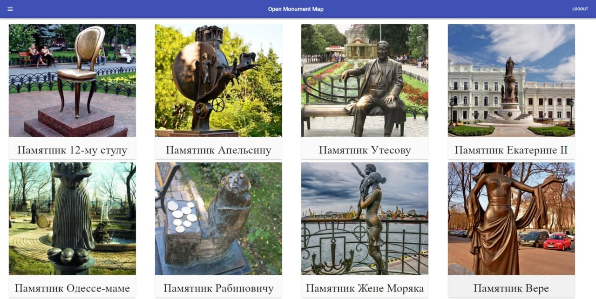

# OpenMonumentMap App
This repository contains a simple MERN app as part of the education project, associated with monuments
# Table of Contents

---

# Project Layout

   Here is the project layout:
   ```
   omm_playground
   |__ api/ (Express Backend)
       |__ src/
       |__ package.json
       |__ package-lock.json
       |__ Dockerfile
       |__ yarn.lock
   |__ client/ (React App Frontend)
       |__ public/
       |__ src/
       |__ package.json
       |__ package-lock.json
       |__ Dockerfile
       |__ yarn.lock
   |__ docker-compose.yml
   ```
## Third party services

[Cloudinary](https://cloudinary.com/) - cloud service that offers a solution to a web application's entire image management

[MongoDB Atlas Database](https://www.mongodb.com/cloud/atlas) - cloud database service, built-in automation for resource and workload optimization

---

## Setting up the `omm_playground` project

1. Start by cloning the project with the command:

```
$ git clone https://github.com/EgorOnufreychuk/omm_playground
```

2. Create .env in /api directory

```
ACCESS_TOKEN_SECRET = 
TOKEN_LIFE = 

PORT = 8000
WHITELIST = ['http://localhost:3000']

TRANSPORTER_SERVICE = 
RESET_PASSWORD_TEMPLATE_LINK = 

NODE_ENV = development

CLOUDINARY_API_SECRET = 
CLOUDINARY_API_KEY = 
CLOUDINARY_NAME = 
CLOUDINATY_FOLDER = 

DEFAULT_MONUMENT_IMAGE_URL = 
DEFAULT_MONUMENT_IMAGE_PUBLIC_ID = 

MONGODB_URL = 

SMTP_EMAIL = 
SMTP_PASSWORD = 
```

## Setting up the `omm_playground` project with Docker

For those that are not interested in setting up the project manually or would simply not have to worry about downloading node.js and its dependencies, were created a Dockerfile and docker-compose.yml file to help create a container with everything you would need to run the **omm_playground**.

### Install Docker

To make this as easy as possible, we will be using *Docker Compose* to create our container.

- If you do not have Docker yet, start by downloading it if you are on a Mac or Windows:
  https://www.docker.com/products/docker-desktop

- Or if you are on a Linux Distribution follow the directions here:
  https://docs.docker.com/compose/install/
  
- To confirm you have Docker Compose, open up your terminal and run the command below:

  ```
  $ docker-compose --version
  docker-compose version 1.27.4, build 40524192
  ```
  
- Go into the project directory to build and run the container with:

  ```
  $ cd omm_playground/
  $ docker-compose up --build
  ```

**This may take a few moments**

Navigate to http://localhost:3000 to view the site on the local server.
It should look something like this:



 ### Cleaning up the Container and Image

  - To stop the container from running, use `<Ctrl-C>` twice.
  - To close down the container use the command:

  ```
  $ docker-compose down
  ```
  - Then to clean up the container and image which we are no longer using use the command:

  ```
  $ docker system prune -fa
  ```

  - Confirm that the container and image is no longer there with:

  ```
  $ docker system df -v
  ```
## Setting up the `omm_playground` project manually
  
  - If you either did not want to use Docker or was curious to build the mern-app manually follow the directions below.
  
  - Start by installing the dependencies for both Express and React:
  ```
  $ cd omm_playground/
  $ cd api/
  $ npm install
  $ cd ../client/
  $ npm install
  ```
  
  Let's first check to see what our React frontend looks like.
  - To run the React server use the command in client directory:
  ```
  $ npm start
  ```
  - Now if you go to http://localhost:3000, you should see something like this:
  
  
  
  The API is not working because well, we are not running our backend yet!
  Let's do that now.
  
  - In another terminal session run the command `npm run serve` at the root directory of the project as we did with the frontend.
  It should look something like this:
  
  
  
  You can see that we have the express server running on port `8000`.
  
  - Now switch back to the http://localhost:3000 and refresh the page. You should see the Message at the bottom be updated!
  
  
  
  We have two servers running, one for the React frontend and one for the Express backend. 
  
## Authors

Created by:

- [Naumenko Hennadii](https://github.com/hnaumenko) (expirenced developer from [Lohika](https://www.lohika.com.ua/))
- [Yehor Onufreychuk](https://github.com/EgorOnufreychuk) (Backend + Frontend)
- [Daniil Polishchuk](https://github.com/DaniilPolishchuk) (Monuments + MonumentById pages)
- [Yaroslav Stoliarchuk](https://github.com/StoliarchukYaroslav) (About page)
  
